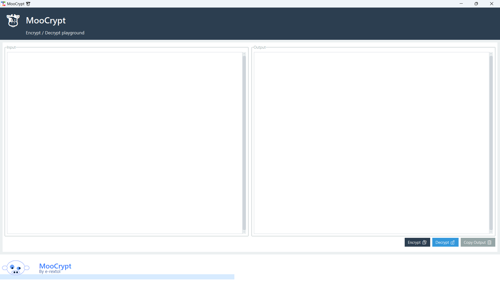
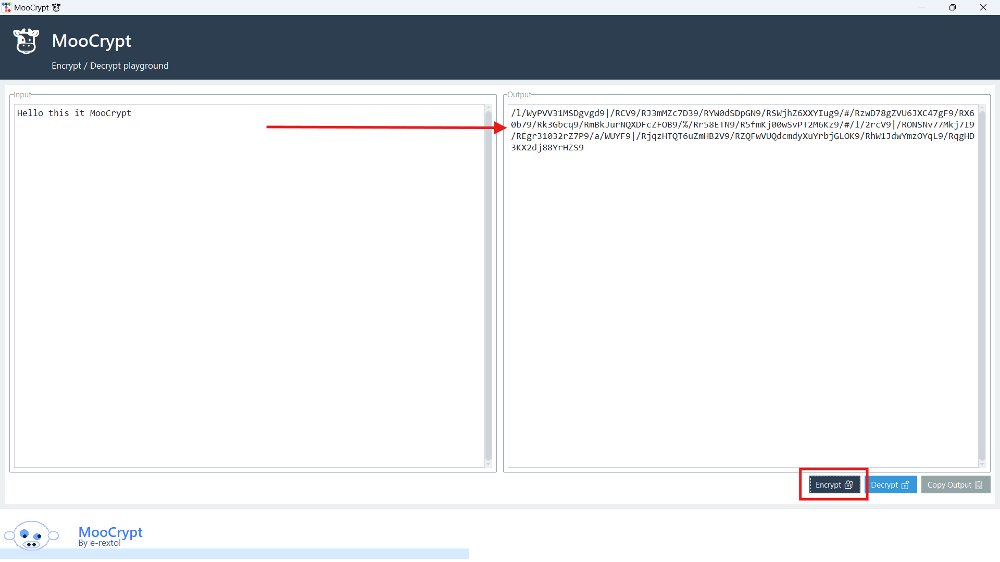
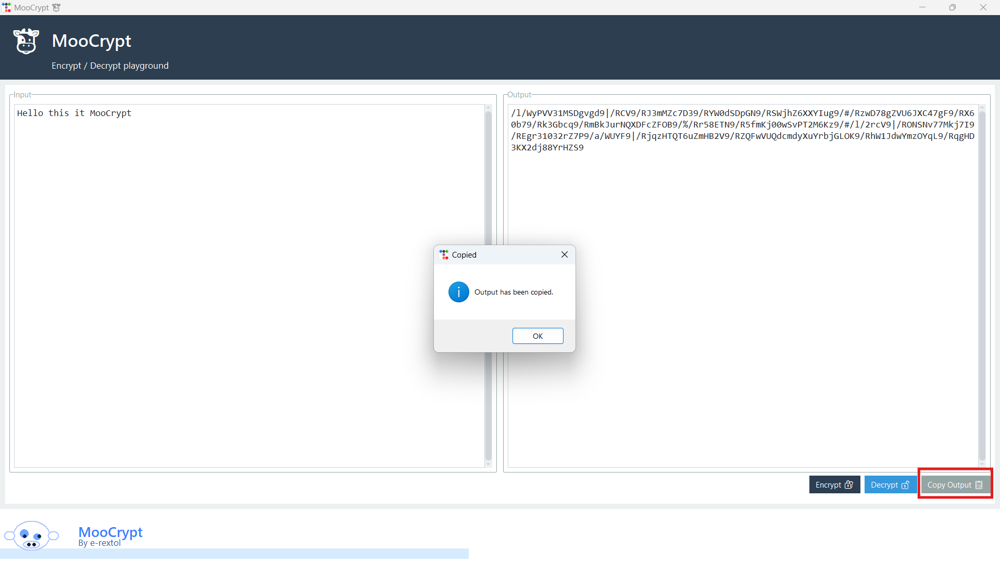
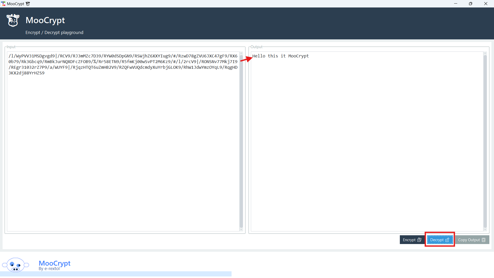

# cryptography-MooCrypt
My fist project in university, This is encryptor/decryptor It's nothing special and I made from my mind :)  

# This project name is MooCrypt 🐮
You can run main.py and use GUI.

#Encryption 🔒
Place you text on input label, click Encrypt box and text encryption will disply on output lable. 

#Decryption 🔑
Place you text encryption on input label, click Decrypt box and text decryption will disply on output lable.

#Encryption Process ⚙️🔒

#Decryption Process ⚙️🔑
